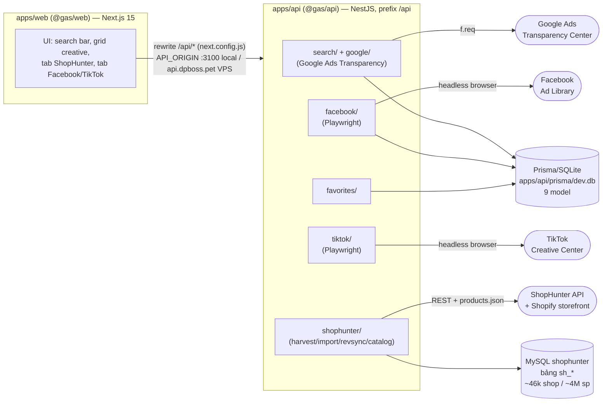
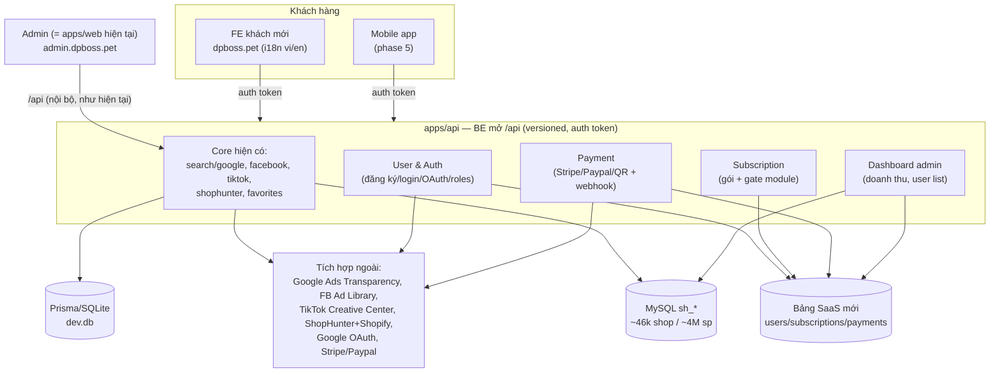

# Kiến trúc tổng thể — Google Ads Spy

> Hub doc: tổng quan hệ thống hiện tại + kiến trúc mục tiêu khi chuyển sang **SaaS**. Chi tiết từng
> mảng nằm ở các docs con liệt kê ở [mục 5](#5-link-tới-docs-con). Dựa trên code thật trong `apps/`
> (đối chiếu `ecosystem.config.js`, `package.json`, `apps/api/src/main.ts`, `apps/api/prisma/schema.prisma`,
> `apps/api/src/shophunter/sh.mysql.ts`, `CHANGELOG.md`) — cập nhật 2026-07-27.

## 1. Tổng quan

**Google Ads Spy** là công cụ self-hosted "spy" quảng cáo/dữ liệu shop của đối thủ, gồm 4 nguồn:

- **Google Ads Transparency Center** — nhập 1 domain → xem nhà quảng cáo + creative đang chạy.
- **Facebook Ad Library** — scrape (Playwright, vì FB chặn request thuần) quảng cáo theo từ khoá/Page.
- **TikTok Creative Center (Top Ads)** — scrape (Playwright bắt XHR) top ads theo ngành.
- **ShopHunter** — clone dữ liệu shop/sản phẩm Shopify (doanh thu, sản phẩm bán chạy…) từ tài khoản
  ShopHunter trả phí của người dùng, cache vào MySQL riêng để duyệt/phân tích không giới hạn quota.

Dự án đang ở giai đoạn **chuyển từ công cụ nội bộ (1 người dùng) sang phần mềm SaaS cho thuê bao**
(nhiều khách hàng, có gói trả phí, sau này có bản mobile). Việc chuyển đổi làm theo từng tiểu dự án
(subsystem) độc lập; tài liệu này mô tả **hệ thống hiện tại** (mục 2) và **đích đến kiến trúc SaaS**
(mục 3–4) đã chốt trong spec thiết kế Phase 0.

## 2. Sơ đồ hiện tại

Monorepo **npm workspaces** (`package.json` gốc: `"name": "google-ads-spy"`,
`"workspaces": ["apps/*"]`), gồm 2 app:

| App | Package | Framework | Cổng local (dev) | Cổng VPS (PM2) | Domain VPS |
|---|---|---|---|---|---|
| `apps/api` | `@gas/api` | NestJS 10 | **3100** (mặc định trong `main.ts` khi không set `PORT`) | **8075** (`ecosystem.config.js` env `PORT='8075'`) | `api.dpboss.pet` |
| `apps/web` | `@gas/web` | Next.js 15 (app router) + React 19 | **3101** (`next dev -p 3101` / `next start -p 3101`) | **3062** (`ecosystem.config.js` gọi thẳng binary `next` với `args: 'start -p 3062'`, KHÔNG qua script `start` của `package.json`) | `dpboss.pet` |

Ghi chú xác minh: các số cổng trên khớp đúng giá trị brief ban đầu đưa ra (3100/8075 cho API,
3101/3062 cho web) — không có sai lệch cần sửa.

BE mount toàn bộ route dưới prefix `app.setGlobalPrefix('api')` (tức `/api/...`), bật CORS mở
(`enableCors({ origin: true })`), nhận body tới 25MB (phục vụ import xlsx/csv của ShopHunter), và có
3 exception filter toàn cục (`GoogleBlockedFilter`, `FbBlockedFilter`, `TtBlockedFilter`) trả **503**
thân thiện khi nguồn ngoài chặn IP. FE gọi BE qua rewrite same-origin `/api/*` → `API_ORIGIN` (mặc
định `http://localhost:3100`; bản build VPS bake `NEXT_PUBLIC_API_ORIGIN=https://api.dpboss.pet`).

Các module chính trong `apps/api/src/` (khai trong `app.module.ts`):

- `search/` + `google/` — tra cứu Google Ads Transparency (client → builder f.req → parser JSON → service phân trang/gom → controller REST).
- `facebook/` — scrape Facebook Ad Library bằng Playwright (`fb.playwright.service`) + parser đệ quy.
- `tiktok/` — scrape TikTok Creative Center Top Ads (Playwright bắt XHR `top_ads/v2/list`).
- `shophunter/` — module lớn nhất (harvest/import/revsync/catalog Shopify, auth Cognito, cache MySQL).
- `favorites/` — theo dõi đối thủ (dùng chung cho Google lẫn Facebook).
- `prisma.service.ts` — kết nối Prisma/SQLite.
- `health.controller.ts` — `GET /api/health`.

Dữ liệu lưu ở **2 nơi tách biệt theo mục đích**:

- **MySQL `shophunter`** (biến `SH_MYSQL_URL`, pool `connectionLimit: 25`) — riêng cho ShopHunter, các
  bảng tiền tố `sh_*` (`sh_shop`, `sh_product`, `sh_product_list`, `sh_search_cache`/`sh_detail_cache`,
  `sh_deep_slice`/`sh_deep_frontier`, `sh_imported`/`sh_imported_product`, `sh_track_history`,
  `sh_harvest_state`/`_slice`/`_daily`, `sh_shop_revenue_daily`, `sh_product_revenue_daily`…). Quy mô
  đã migrate local→VPS: **~46 nghìn shop / ~4 triệu sản phẩm** (xác nhận qua `CHANGELOG.md` mục
  migrate và `docs/archive/11-restart-stack.md`), chạy trên MySQL 8.0.46 (VPS, dùng chung server với
  DB khác).
- **Prisma + SQLite** (`apps/api/prisma/dev.db`) — 9 model hiện tại theo `schema.prisma`: `Search` /
  `Advertiser` / `Creative` (lịch sử tra Google Ads Transparency), `FbSetting` (cookie phiên FB),
  `FbPagePostsScan` / `FbPostRow` (lịch sử quét bài Page FB), `Favorite` (theo dõi đối thủ),
  `FbSearch` / `FbAd` (lịch sử Facebook Ad Library). Đây là DB "nhẹ" cho ads (Google/FB/TikTok),
  tách hẳn khỏi MySQL của ShopHunter.

## 3. Kiến trúc mục tiêu SaaS

Theo spec thiết kế (`docs/superpowers/specs/2026-07-27-saas-refactor-phase0-design.md`), các quyết
định kiến trúc đã chốt cho chặng SaaS:

- **App hiện tại (`dpboss.pet`, tức `apps/web` như mô tả ở mục 2) → đổi vai trò thành Admin**, chuyển
  sang subdomain **`admin.dpboss.pet`**: khu quản trị nội bộ + toàn bộ tính năng hiện có (Google/FB/
  TikTok/ShopHunter). Đây là đổi **vai trò**, chưa di chuyển vật lý thư mục (`apps/web` vẫn giữ
  nguyên tên/đường dẫn để không phá PM2/`ecosystem.config.js`/`deploy.sh`) — dời cấu trúc vật lý sang
  `FE/`/`BE/` để sau, ở phase dựng FE khách (phase 6, xem mục 4 phân rã dưới).
- **FE khách hàng MỚI tại `dpboss.pet`** (chiếm lại domain gốc) — re-skin dựa trên giao diện hiện tại,
  **đa ngôn ngữ (i18n)**, dành cho người dùng thuê bao (không phải quản trị viên).
- **BE (NestJS, `apps/api`) mở rộng `/api`** thành API có **auth token** (versioned), dùng **chung**
  cho web khách mới lẫn mobile app. Khác với hiện tại: `/api` bây giờ chỉ là prefix nội bộ, không auth,
  chỉ phục vụ chính `apps/web` (Admin) gọi qua rewrite same-origin — mục tiêu là tách một lớp `/api`
  công khai có xác thực để bên ngoài (web khách, mobile) gọi trực tiếp.
- **Dữ liệu giữ nền**: MySQL `sh_*` + Prisma/SQLite như hiện tại; **thêm bảng SaaS mới** (users /
  subscriptions / payments) ở các phase sau.
- **4 subsystem SaaS mới** (thêm vào hệ thống hiện có, không thay thế):
  1. **User & Auth** — đăng ký/đăng nhập/quên-reset mật khẩu, Google OAuth, phân quyền
     Admin/Manager/User.
  2. **Subscription** — gói thuê bao theo tháng/năm, gate tính năng theo module.
  3. **Payment** — Stripe / Paypal / chuyển khoản QR + webhook kích hoạt/gia hạn gói.
  4. **Dashboard admin** — doanh thu theo khoảng ngày (mặc định tháng hiện tại), danh sách user
     (tên/mail/đt/gói/giá/ngày đăng ký/hết hạn), ban/sửa/xóa user.

Thứ tự triển khai (phụ thuộc tuần tự, mỗi tiểu dự án có spec/plan riêng khi tới lượt):

| # | Tiểu dự án | Phụ thuộc |
|---|---|---|
| 0 | Chuẩn hóa repo + docs (đang làm — tài liệu này) | — |
| 1 | User & Auth | 0 |
| 2 | Gói subscription + gate theo module | 1 |
| 3 | Thanh toán (Stripe/Paypal/QR + webhook) | 2 |
| 4 | Dashboard admin | 1–3 |
| 5 | API mobile (đóng gói `/api` công khai + auth token) | 1 |
| 6 | FE khách re-skin + i18n | 1–5 |

## 4. Sơ đồ mục tiêu

## 5. Link tới docs con

- [Các module Backend](./backend-modules.md) — chi tiết từng module `apps/api`: shophunter, facebook,
  google, tiktok, search, prisma; endpoint chính; kế hoạch mở `/api` công khai cho mobile.
- [Frontend](./frontend.md) — cấu trúc `apps/web` hiện tại (= Admin); kế hoạch FE khách + i18n.
- [Database](./database.md) — MySQL `sh_*` + Prisma/SQLite chi tiết; bảng SaaS dự kiến.
- [Tích hợp & Webhook](./integrations-webhooks.md) — ShopHunter API, Google Ads Transparency, FB Ad
  Library, storefront Shopify; kế hoạch Google OAuth + webhook Stripe/Paypal/QR.
- [Deployment](./deployment.md) — VPS/PM2 (2 process)/nginx/Cloudflare, quy trình deploy an toàn.
- [Lộ trình SaaS](./roadmap.md) — 6 tiểu dự án ở mục 3, trạng thái từng cái.
